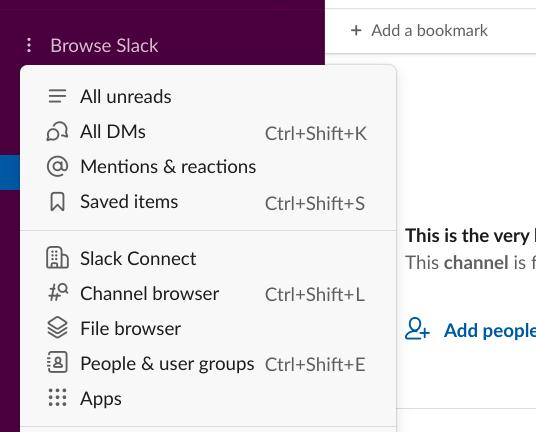
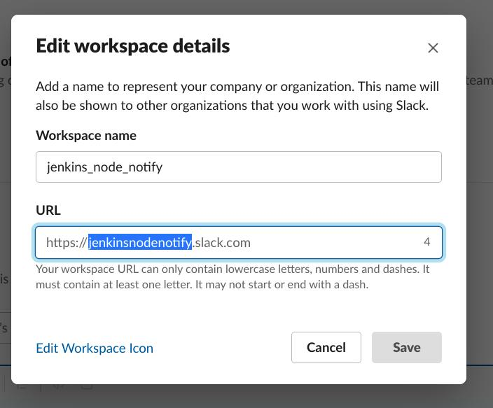
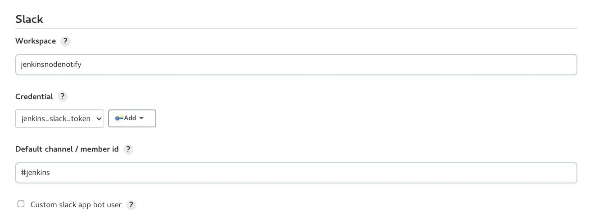
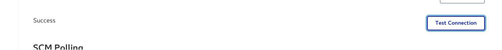
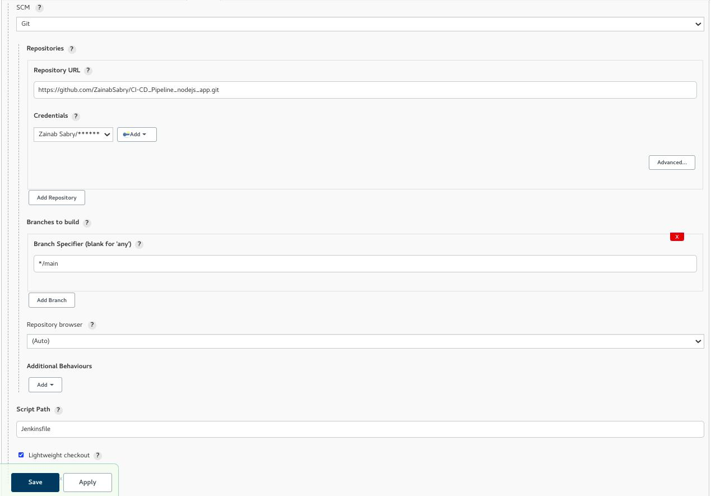

# CI/CD_Pipeline_node.js_app


## Description
Using Jenkins pipeline, deploying a node.js application on a Jenkins slave (private EC2 instance) which also serves to test your application's connectivity to RDS and ElastiCache instances.

## Earlier Step:

It is recommended that you follow the infrastructure pipeline steps before running this CI/CD pipeline, for the infrastructure pipeline, <b> Press the Terraform icon</b>:

<p align="center">
<a href="https://github.com/ZainabSabry/AWS_Infrastructure_Pipeline.git"></a>
</p>

## Getting Started

### 1- Prequisites:
- Make sure you have a Jenkins Slave EC2 instance online and running successfully

- Create a credential for your dockerhub account of type (username and password)

- Create a credential for your rds instance, if you have provisioned one, of type (username and password)

- Edit the Jenkinsfile to include the endpoints of both your RDS and ElastiCache instances

```bash
environment {
        rds_hostname = 'RSD_Endpoint'
        redis_hostname    = 'REDIS_Endpoint'
        }
```

### 2- Configuring Slack for Notifications
<br>

- Install "Slack Notification" plugin
- Create new slack workspace and a new channel
- Add jenkins CI to Slack from "Browse Slack" => "Apps"
<br>

<p align='center'>

</p>

- Follow the steps to configure the Jenkins CI with slack: 
<br>
    - Create a "Secret Text" Credential for the token
    - Configure the slack plugin under "Configure System" as follows:  workspace name, channel name, and credential

<p align='center'>

</p>

<p align='center'>

</p>

- To make sure it is successfully connected, you should press "Test Connection" Button and get "Success"

<p align='center'>

</p>


### 3- Creating and Running Pipeline

- Create a pipeline as follows:
<p align='center'>

</p>

- Then press 'save' and 'Build Now'

- To test your application, you can do one of the following:

    - If you have the slave configured as an Ansible agent, then run the following:
    ```bash
    $ ansible slave -m uri -a "url=http://localhost:3000"

    $ ansible slave -m uri -a "url=http://localhost:3000/db"

    $ ansible slave -m uri -a "url=http://localhost:3000/redis"

    ```
    - You can also test using the ALB we built in the earlier step:
    ```
    http://ALB_ENDPOINT/
    http://ALB_ENDPOINT/db
    http://ALB_ENDPOINT/redis
    ```
    - In case above options are not available, then you can ssh into the Jenkins slave, and curl:
    ```bash
    $ curl http://localhost:3000
    $ curl http://localhost:3000/db
    $ curl http://localhost:3000/redis
    ```

## Tools
<p align="center">


</p>
